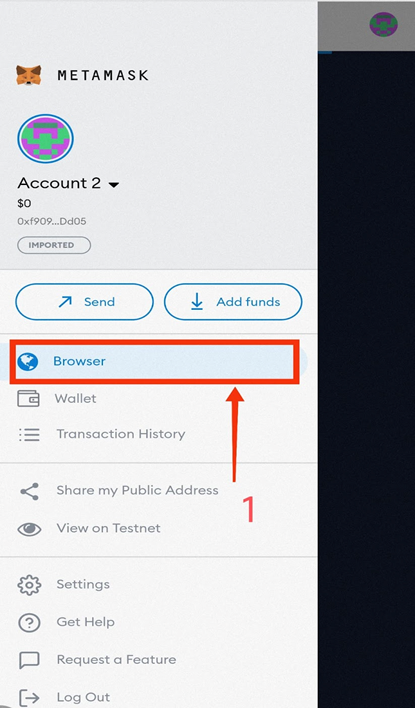
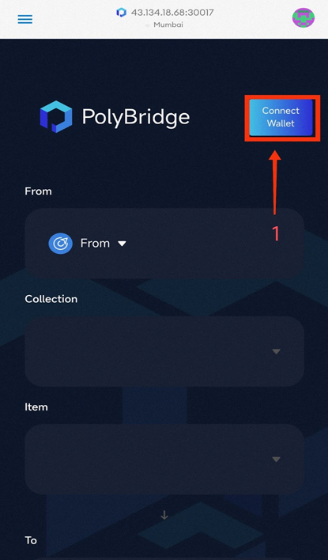
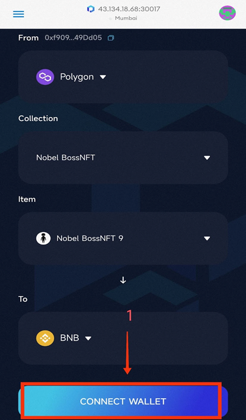
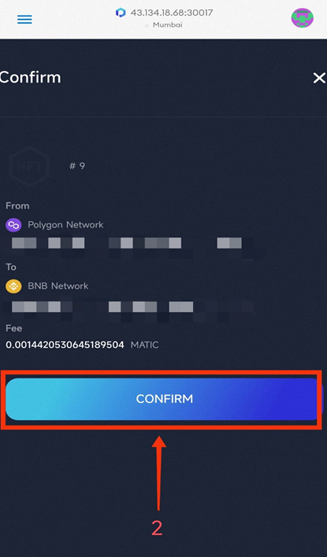
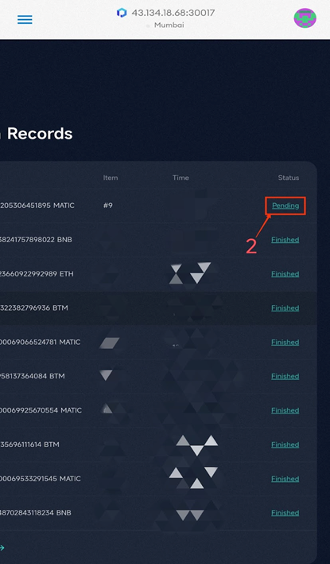

<h1 align="center">NFT Transaction on MT</h1>

Poly Network has released Poly Bridge version 2.0 recently, significantly optimizing the interface and improving functionality based on 1.0. 
This user manual serves as a guide for transacting NFTs on the brand new Poly Bridge 2.0 with your mobile terminals.

> [!Note|style:flat|label:Notice]
> Currently the transaction between Ontology and Neo is not supported in mobile terminals.

As an example, this manual uses the NFT transaction between BNB chain and Polygon in MetaMask. 
A successful cross-chain transaction requires the completion of the following 7 steps.

### Step1. Entering PolyBridge Page
Find the browser in the wallet App, enter the URL: https://bridge.poly.network/nft, and go to the NFT transaction page. The figures below show an example in MetaMask.

> [!Note|style:flat|label:Notice]
> The following steps are the same as that in the [NFT Transaction on PC](../../Core_Smart_Contract/User_Manuals/NFT_Transaction.md).

### Step2. Wallet and Network Connection
Find the button “Connect Wallet” in the top right corner of this page and connect your wallet to the source chain from which you want to transfer NFT. 
Make sure the network of your wallet stays consistent with that of the source chain you selected. 
In this example, we have selected Polygon as source chain, as shown in the figure:

### Step3. Transaction Information Selection
Select the transaction information, including source chain (in From), the NFT asset you want to transfer (in Collection), the NFT item you want to transfer (in Item) and target chain (in To).

> [!Note|style:flat|label:Notice]
> The transaction will fail to process if the network of your wallet is inconsistent with that of the source chain. Additionally, make sure you indeed own the NFT collection you select or the transaction will not be processed.

### Step4. Target Chain Wallet Connection
After filling out the transaction information, click “Connect Wallet” below, and then click on the target chain wallet to which you want to transfer NFT.

> [!Note|style:flat|label:Notice]
> After successfully connecting the wallet, you should check again to see whether the transaction information listed above is complete and correct.

### Step5. Transaction Authorization
Click “Approve”. 
You should check the approved information in your wallet, and then click “Approve”.

### Step6. Transaction Information Confirmation and Transaction Completion
Click “Next” and check the transaction information. 
Click “Confirm” in the pop-up window, and click “Confirm” in the wallet to submit the transaction.

After the transaction is submitted, the transaction progress will be displayed. 
When all the three transaction stages are completed, the transaction is finished. 

> [!Note|style:flat|label:Notice]
> You can close the pop-up window at any time during the process, and check the transaction status in “History”.

### Step7. Results Checking
Click on “History” to view the record of processed transactions.
You can swipe to the right to view the complete transaction history.
Details of the assigned transaction can be viewed by clicking on the status list. 
For completed transactions, the status is displayed as “Finished”.

Congratulations! 
You’ve now completed your cross-chain NFT transaction in the mobile terminal!

