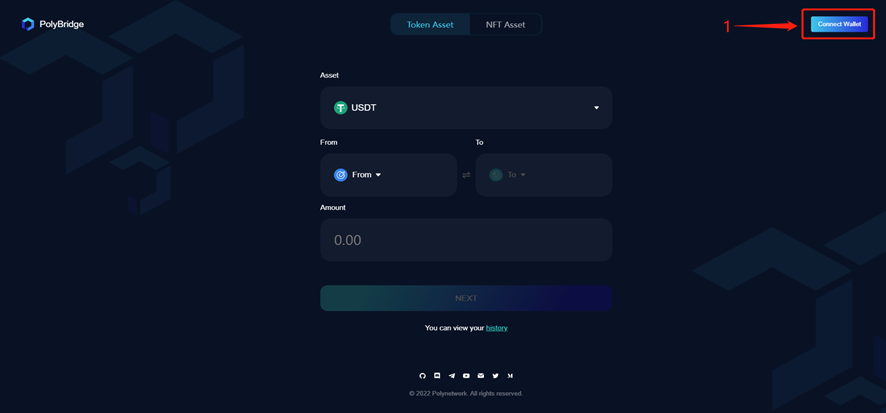
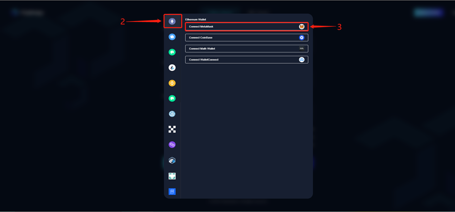
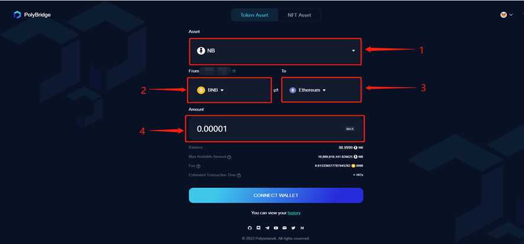
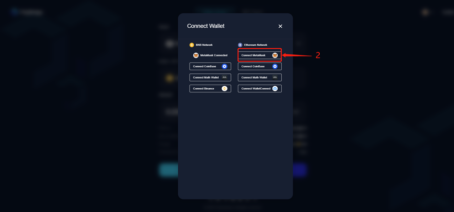
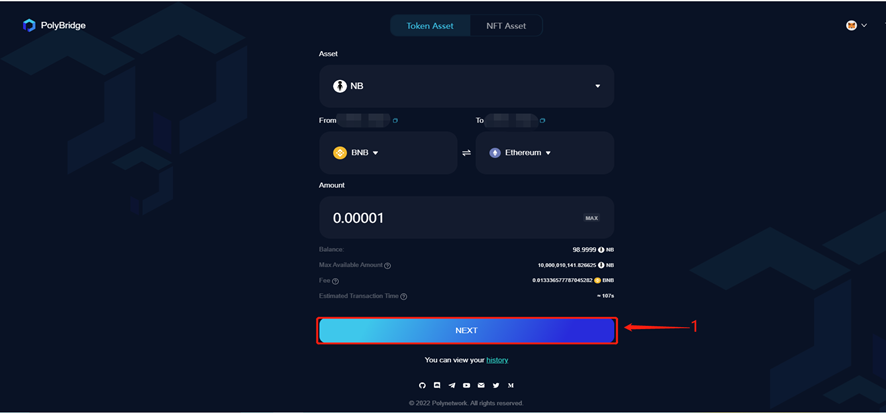
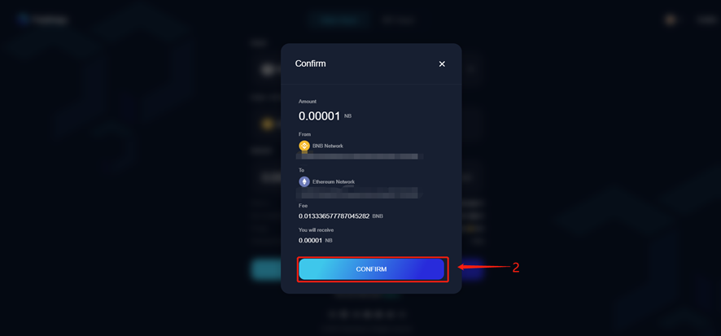
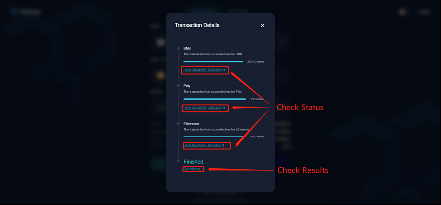
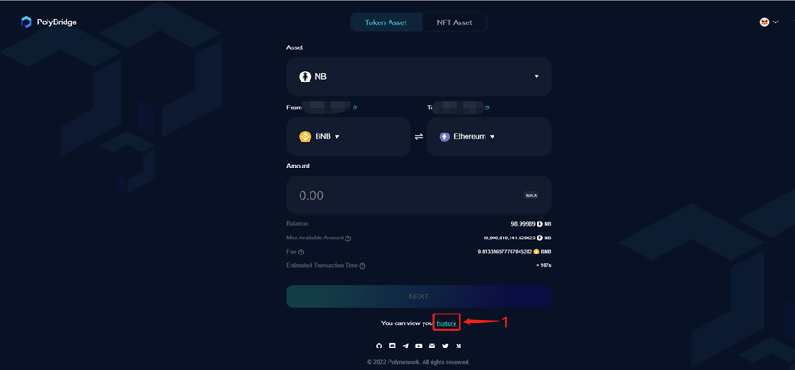
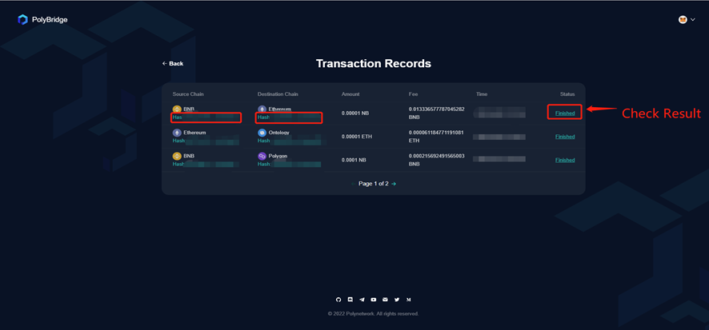

<h1 align="center">Token Transaction for PC User</h1>

Poly Network has released Poly Bridge version 2.0 recently, significantly optimizing the interface and improving functionality based on 1.0. 
This user manual serves as a guide for transacting Tokens on the brand new Poly Bridge 2.0.

> [!Note|style:flat|label:Notice]
> To enter the Poly Bridge 2.0 interface, please click [PolyBridge](https://bridge.poly.network/) and go to the Token transaction page. 
> As an example, this manual uses the Token transaction between BNB chain and Ethereum. 

A successful cross-chain transaction requires the completion of the following 6 steps.

You can either watch the video or follow the manual below.

<html>
<body>

<video width="800" height="480" controls="controls">
  <source src="Video for Token Transaction.mp4" type="video/mp4">
  <object data="Video for Token Transaction.mp4" width="800" height="480">
    <embed width="800" height="480" src="Video for Token Transaction.swf">
  </object>

</video>

</body>
</html>

### Step 1. Wallet and network connection
Find the button “Connect Wallet” in the top right corner of this page and connect your wallet of the source chain from which you want to transfer Token. 
Make sure the network of your wallet stays consistent with that of the source chain you selected. 
In this example, we have selected BNB as source chain, as shown in the figure:

### Step 2. Transaction information filling
Select the Token you want to transfer (in Asset), the source chain (in From), the target chain (in To), and the amount of assets to be traded (in Amount) in order.

> [!Note|style:flat|label:Notice]
> A warning “You’ve exceeded the max amount” will pop up if you fill in the transaction amount without connecting to a wallet. 
> Then click “Connect Wallet” to connect the source chain and the target chain wallets. 

### Step 3. Target chain wallet connection
After filling out the transaction information, click “Connect Wallet”, and then click on the target chain wallet to which you want to transfer Token to.

### Step 4. Transaction information confirmation
After connecting the target chain wallet, click “Next”, check the transaction information (including Token, source chain, target chain, transaction asset and fee) in the pop-up window, and click “Confirm”. 
Then you need to submit the transaction in your wallet after checking.

> [!Note|style:flat|label:Notice]
> If this is the first time you interact with Poly Bridge, before transaction submission, an approval is required (Approve Infinity or the amount you literally need).

### Step 5. Transaction completion
After the transaction is submitted, the progress of the transaction will be displayed on the page. 
When all the three stages of the transaction are completed, the transaction is finished.

> [!Note|style:flat|label:Notice]
> You can close the pop-up window any time during the transaction, and come back to check the transaction status in “history”.

### Step 6. Result checking
Click on “history” to view the record of processed transactions. 
Details of the assigned transaction can be viewed by clicking the status list. 
For completed transactions, the status is displayed as “Finished”.

Congratulations! You’ve completed your cross-chain token transaction!

