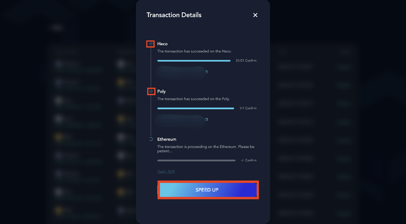
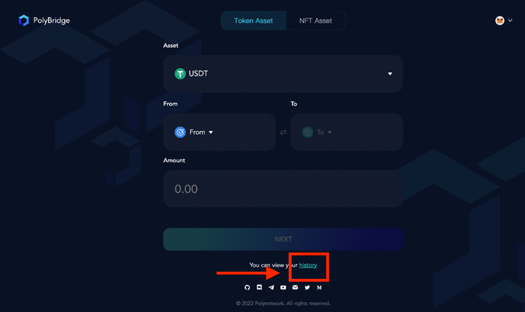
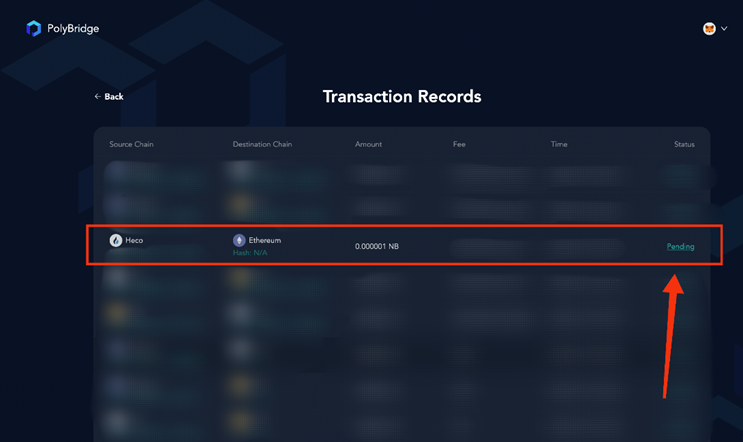
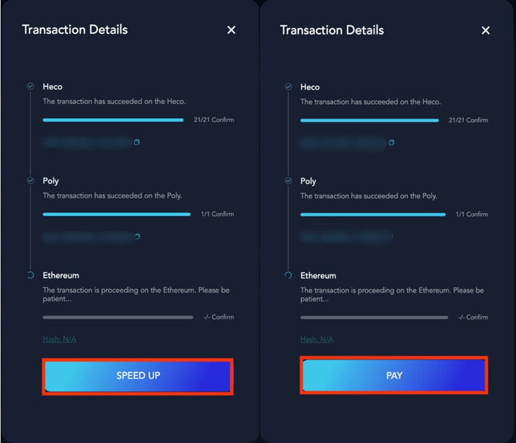
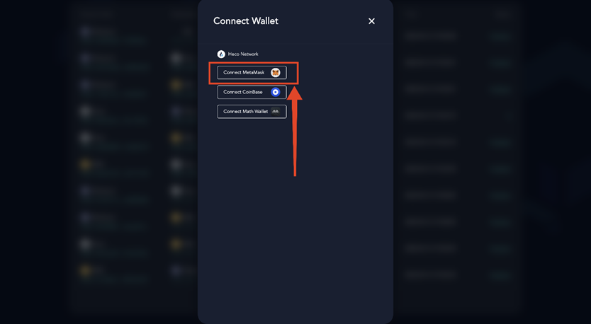
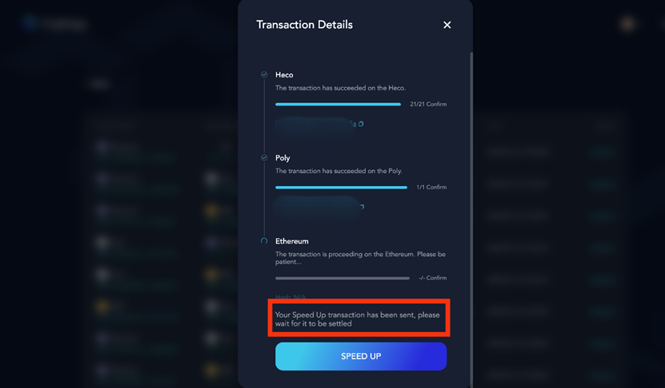

<h1 align="center">Transaction Acceleration</h1>

Poly Bridge releases the **acceleration function** to help users speed up transactions when dealing with congested networks. 
This manual will show you how to use this function with the example of token transfer between **Heco** and **Ethereum**.

At the very beginning, please check the status of your transaction.
When you have submitted a cross-chain transaction completed in Poly, click **SPEED UP** to use the **acceleration function**.

> [!Note|style:flat|label:Notice]
> If your transaction is only completed in the source chain, this function does not work.

Here are four steps listed for you to accelerate your transaction on [Poly Bridge](https://bridge.poly.network/).

### Step1. Transaction selection
Firstly, you should find the transaction that you want to accelerate. Click **History** on [Poly Bridge](https://bridge.poly.network/) to view the previous transaction, as shown in the figure.

### Step2. Status checking
Then check the status of the transaction and click **Pending**. 

### Step3. Speed-up or fee payment
Now you can click **SPEED UP** or **PAY** if you didn't pay a gas fee for this transaction shown in the figure.

> [!Note|style:flat|label:Notice]
>- Please ensure that your wallet is connected to the **target network**. If not, you must switch network first and then back to the **Speed Up** page. Remember that the network settings in your wallet should be consistent with the target network in Poly Bridge.
>- If you haven’t connected your **wallet** yet, the pop-up window will require you to connect your wallet. After that, exit the page and go back to the **Speed Up** page.

Now you can accelerate your transaction by clicking Speed Up or Pay and submitting an acceleration request.

If you encounter an error report as shown in the figure, please do not resubmit this transaction. Turn back to your wallet to check the balance.  

### Step4. Result checking
After successfully submitting an accelerated transaction, you'll see a page as below, and please wait for a while.

If it still doesn't work, please contact `Poly team` via .

