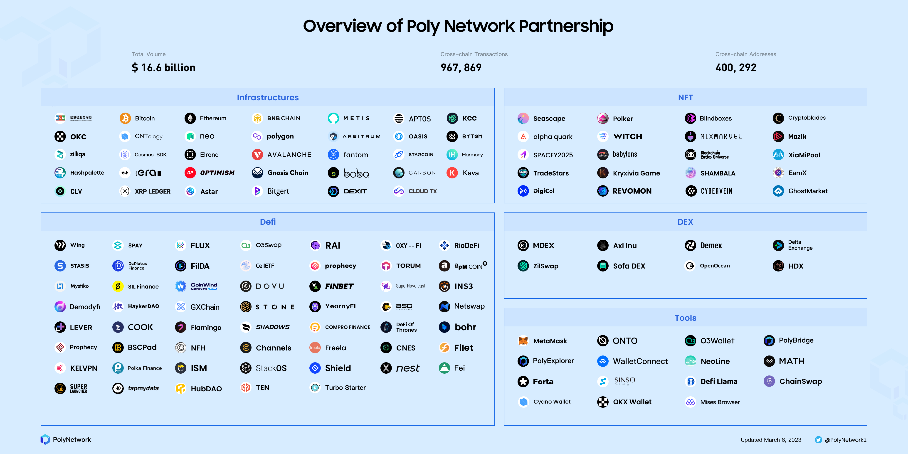

<h1 align="center">Poly Network</h1>

Poly Network is the world’s leading cross-chain protocol for heterogeneous chains, enhancing connections between ledgers by providing Web 3.0 interoperability. 
Its uniquely designed cross-chain bridge technology executes cross-chain transactions by deploying smart contracts on the source chain. This enables communication between heterogeneous chains, including the most popular public chains, right at the protocol layer.

Poly Network has integrated over 20 blockchains, including Ethereum, BNB Chain, Polygon, Avalanche, Fantom, Arbitrum, Optimism, Metis, Boba, OKC, HECO, Neo, Ontology, Zilliqa, Gnosis Chain, etc.

## Poly Network Provides

- A Protocol for connecting new chains to Poly Network
- A Protocol for registering new cross-chain tokens
- A Protocol for building your bridges
- Specifications for customizing business logic contracts

## Poly Network-powered Tools and Services

---

> @[Poly Bridge]{`https://bridge.poly.network/`}
> `resources/PolyBridge-Black.png` "rect"

---

> @[ChainSwap]{`https://chainswap.com/`}
> `resources/chainswap.jpg` "rect"

---

> @[Demex]{`https://dem.exchange/`}
> `resources/Demex.png` "rect"

---

> @[O3Swap]{`https://o3swap.com/`}
> `resources/O3Swap.png` "rect"

---

> @[MDEX]{`https://mdex.com/#/`}
> `resources/Mdex.jpg` "rect"

---

> @[Flamingo]{`https://flamingo.finance/`}
> `resources/Flamingo.png` "rect"

---

> @[Wing]{`https://wing.finance/`}
> `resources/Wing.svg` "rect"

---

> @[ZilBridge]{`https://zilswap.io/bridge`}
> `resources/ZilBridge.png` "rect"

## Join the Community

> @[Telegram]{`https://t.me/polynetworkgroup`}
> `resources/Telegram.png` "rect"

---

> @[Discord]{`https://discord.com/invite/y6MuEnq`}
> `resources/Discord.png` "rect"

---

> @[Medium]{`https://polynetwork.medium.com/`}
> `resources/Medium.png` "rect"

---

> @[Github]{`https://github.com/polynetwork`}
> `resources/GitHub.png` "rect"

---

> @[Twitter]{`https://twitter.com/PolyNetwork2`}
> `resources/Twitter.png` "rect"

---

> @[Youtube]{`https://www.youtube.com/channel/UC4vFRyVgvK7RnlkkLDmp23w/featured`}
> `resources/youtube.png` "rect"

---

